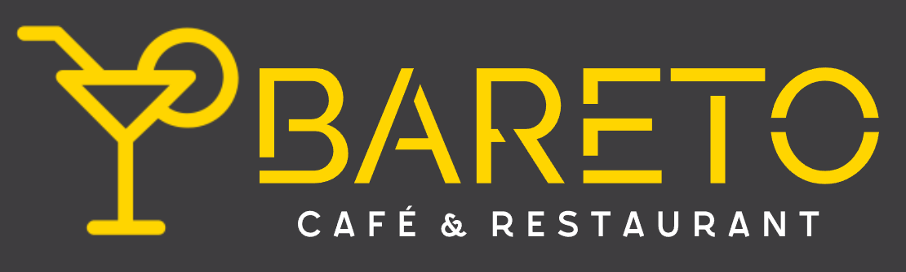

  

---
# 🍻 Bareto

**Bareto** is een moderne webapplicatie waarmee klanten eenvoudig hun bestelling kunnen plaatsen via het scannen van een QR-code — zonder dat ze naar de toog hoeven te gaan. Ideaal voor gebruik in horecazaken zoals bowlingbanen, poolcafés of bars.

---

## 🚀 Functionaliteiten

- 📷 **QR-scanner**: Scan een QR-code met je telefoon om je tafelnummer op te halen.
- 📱 **Mobielvriendelijk**: De scanner gebruikt de achtercamera van je smartphone voor optimale ervaring.
- 🛒 **Winkelmandje**: Selecteer drankjes of snacks en bekijk je bestelling in een overzicht.
- 🪑 **Bestellen vanaf je tafel**: Geen wachtrijen meer — je blijft gewoon zitten en bestelt rechtstreeks.
- 🔔 **Pushmelding**: Je krijgt een bevestiging via een notificatie zodra je bestelling is geplaatst (desktop en ondersteunde mobiele browsers).
- 📦 **PWA (Progressive Web App)**: Voeg Bareto toe aan je beginscherm zoals een app, zelfs offline ondersteuning aanwezig.

---

## 🛠️ Technische Details

- Gemaakt met **HTML**, **CSS**, en **JavaScript**
- QR-code scanning met behulp van [`html5-qrcode`](https://github.com/mebjas/html5-qrcode)
- Service Worker en cache voor offline functionaliteit
- Manifest voor PWA-ondersteuning

---

## 🔧 Installatie & Gebruik

1. Ga naar de live versie:  
👉 **[https://bareto-f0a73.web.app/](https://bareto-f0a73.web.app/)**

2. Scan een QR-code met je smartphone om je tafelnummer door te geven.

3. Selecteer producten en bevestig je bestelling.

---
